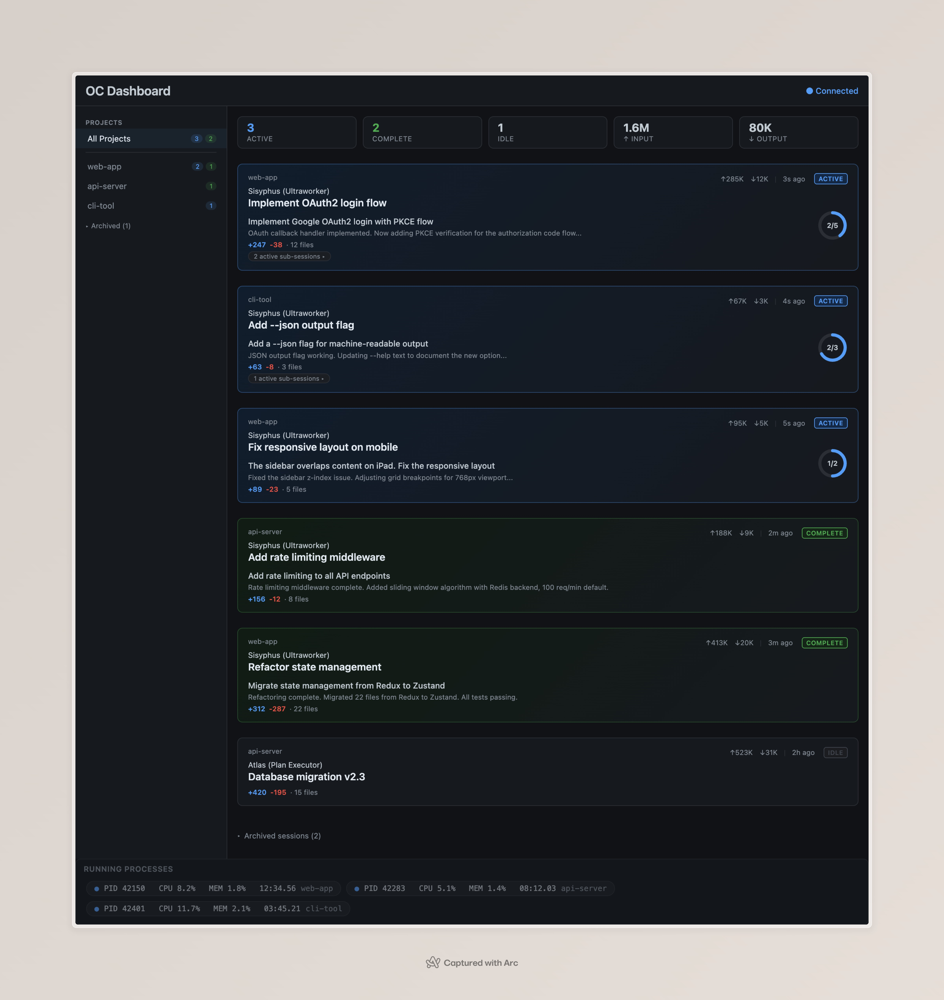

<p align="center">
  <h1 align="center">OC Dashboard</h1>
  <p align="center">
    Real-time session monitoring for <a href="https://opencode.ai">OpenCode</a>
  </p>
</p>

<p align="center">
  
</p>

---

여러 프로젝트에서 동시에 OpenCode 세션을 돌릴 때, 각 세션의 상태(ACTIVE / COMPLETE / IDLE), 진행률, 토큰 사용량, 에이전트 정보 등을 한 눈에 파악하기 위해 만들었습니다.

> 이 프로젝트의 모든 코드는 [OpenCode](https://opencode.ai) + [OhMyOpenCode](https://github.com/jaemin-bang/ohmyopencode)로 구현되었습니다.

## Features

| Feature | Description |
|---|---|
| **실시간 모니터링** | SSE 기반 2초 간격 자동 갱신 |
| **프로젝트별 관리** | 사이드바에서 프로젝트 선택, ACTIVE/COMPLETE 카운트 |
| **세션 카드** | 에이전트명, 메시지 프리뷰, git diff, todo 진행률 |
| **토큰 집계** | 세션별/프로젝트별 input·output 토큰 사용량 |
| **데스크톱 알림** | 세션 완료 시 알림, 대시보드 포커스 중엔 자동 비활성화 |
| **Dismiss** | COMPLETE 카드 또는 알림 클릭으로 즉시 IDLE 전환 |
| **아카이브** | 3일 이상 비활성 세션/프로젝트 자동 분리 |
| **Sub-agent** | 활성 서브 세션 카운트 및 펼쳐보기 |
| **제로 의존성** | Bun 단일 서버, 외부 프레임워크 없음 |

## Quick Start

**Prerequisites**: [Bun](https://bun.sh) v1.0+ · [OpenCode](https://opencode.ai)

```bash
# 1. Clone
git clone https://github.com/deokdory/oc-dashboard.git
cd oc-dashboard

# 2. Plugin — OpenCode에 세션 상태 전달용
mkdir -p ~/.config/opencode/plugins
ln -s "$(pwd)/plugin/index.ts" ~/.config/opencode/plugins/oc-dashboard-plugin.ts

# 3. Run
bun run server.ts
```

`http://localhost:3333` 접속.

### Environment Variables

| Variable | Description | Default |
|---|---|---|
| `PORT` | 서버 포트 | `3333` |
| `DB_PATH` | OpenCode DB 경로 | `~/.local/share/opencode/opencode.db` |

### Remote Access

같은 네트워크의 태블릿/폰에서 접속 가능합니다.

```bash
ipconfig getifaddr en0   # LAN IP 확인
```

`http://<LAN_IP>:3333` 접속.

## Tech Stack


## License

[MIT](LICENSE)
